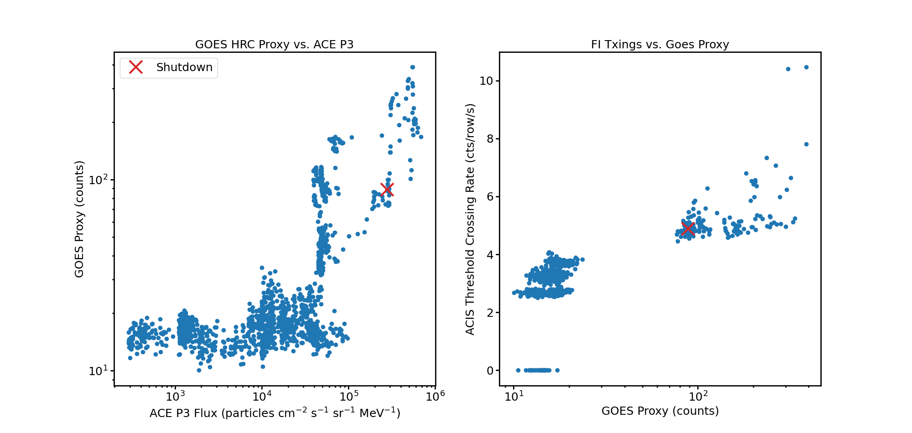
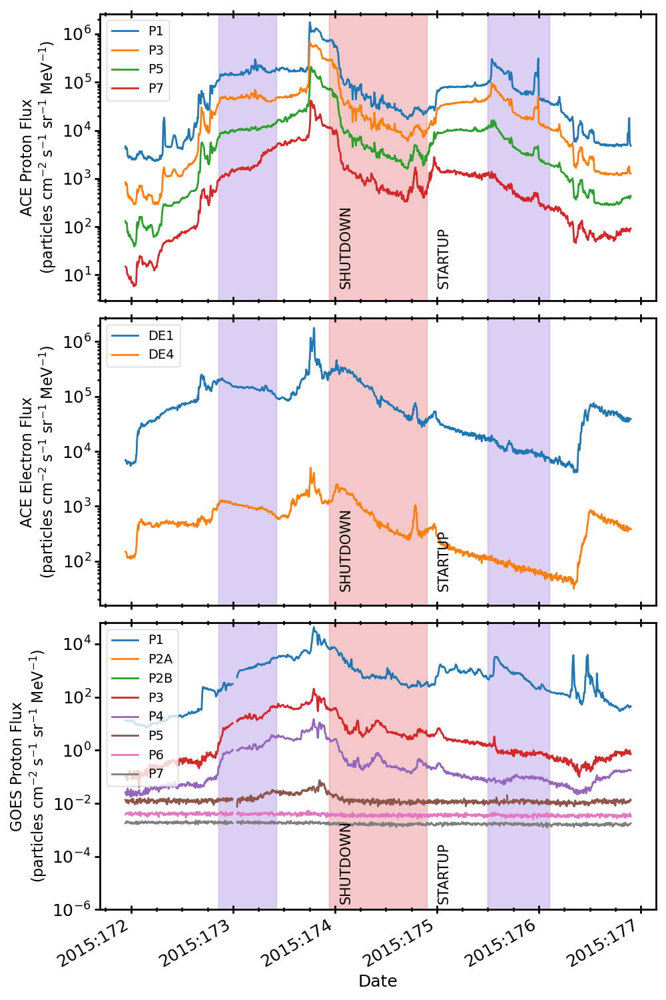

.. _2015-173:

2015:173
--------------

Basic Facts
===========

* Load on Spacecraft: JUN2115A  
* Shutdown: YES  
* Shutdown Trigger: Manual  
* Shutdown Time: 2015:173:22:40:00.000  
* Startup Time: 2015:174:21:40:00.000  

Plots
=====

Radiation vs. Time
++++++++++++++++++

Proton Spectra at Selected Times
++++++++++++++++++++++++++++++++

Scatter Plots
+++++++++++++

ACE Plots
+++++++++

Goes Proton Plots
+++++++++++++++++

.. image:: goes_r_vs_time.png

