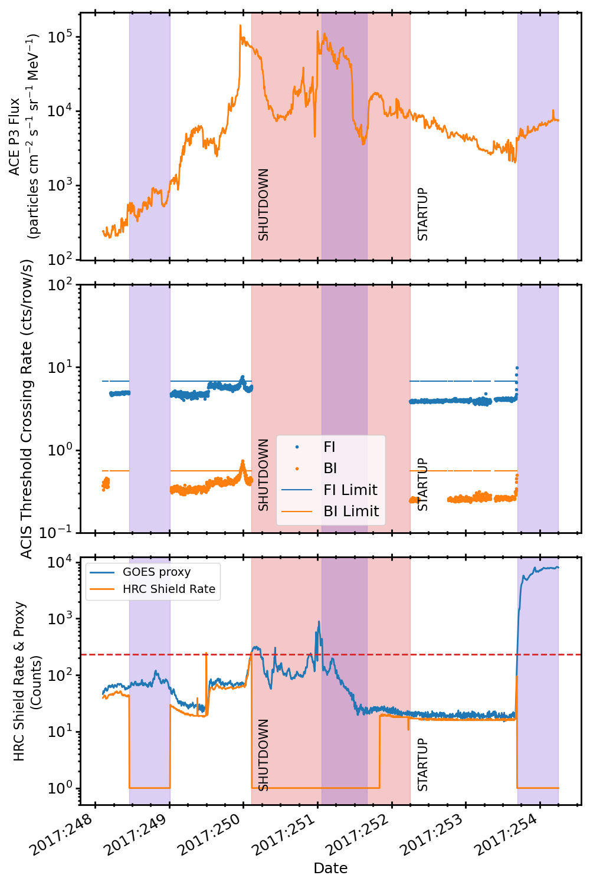
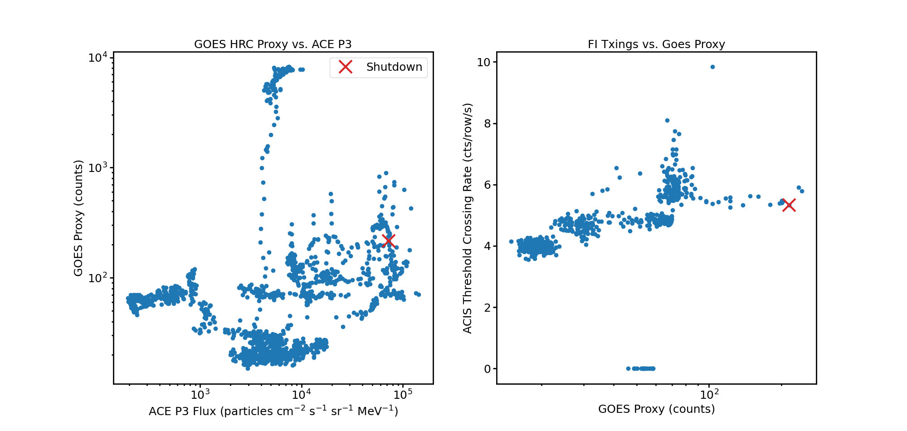

.. _2017-250:

2017:250
--------------

Basic Facts
===========

* Load on Spacecraft: SEP0417A  
* Shutdown: YES  
* Shutdown Trigger: HRC Anti-Co Shield  
* Shutdown Time: 2017:250:02:31:00.000  
* Startup Time: 2017:252:06:04:00.000  

Plots
=====

Radiation vs. Time
++++++++++++++++++

Proton Spectra at Selected Times
++++++++++++++++++++++++++++++++

Scatter Plots
+++++++++++++

Proton & Electron Plots
+++++++++++++++++++++++

