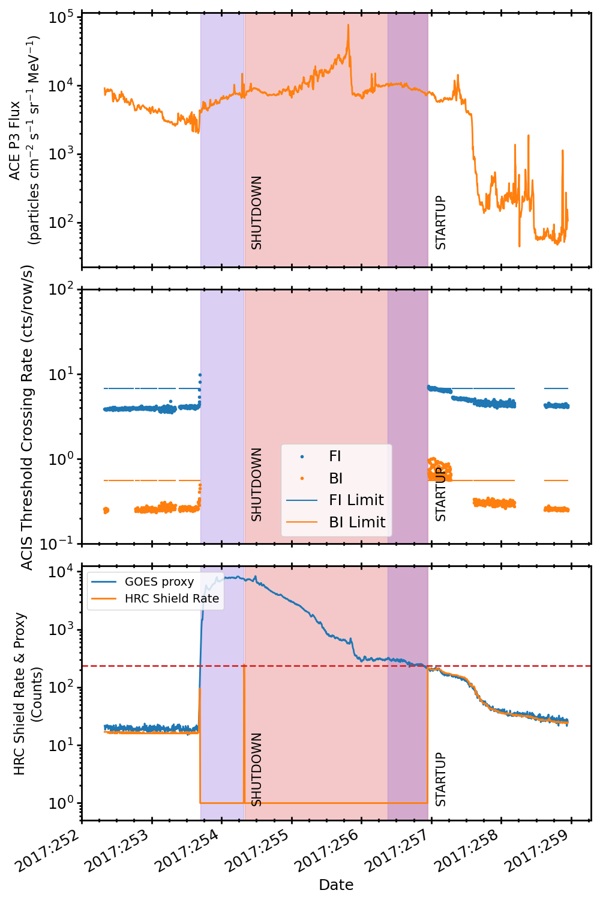
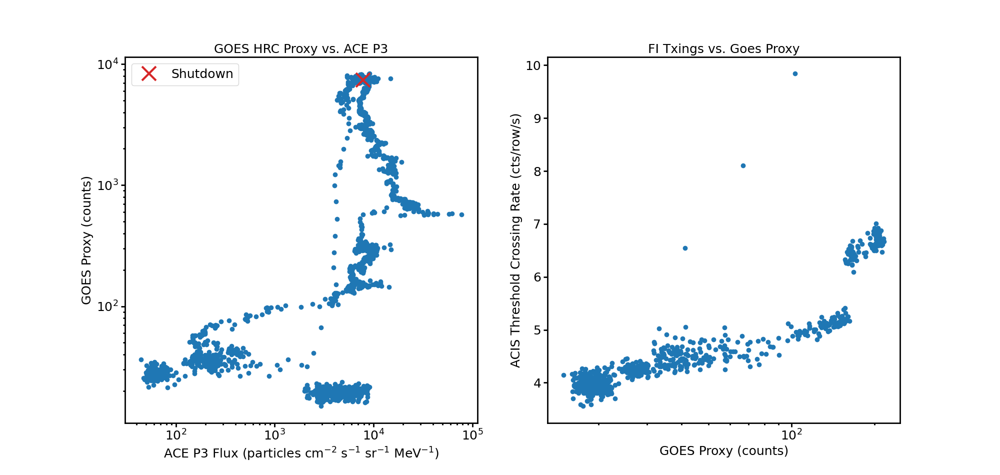
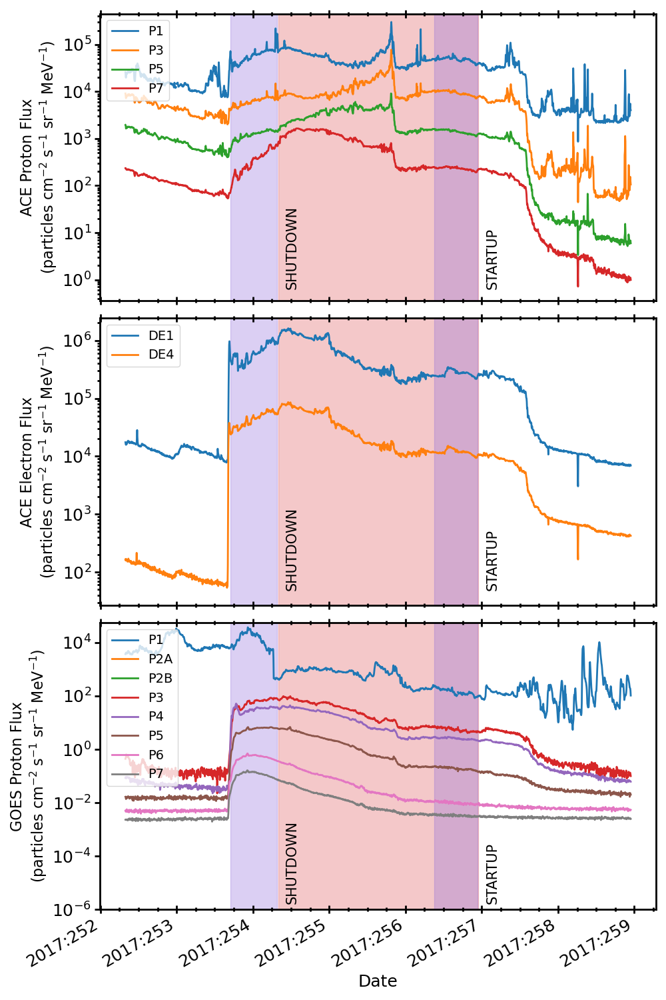

.. _2017-254:

2017:254
--------------

Basic Facts
===========

* Load on Spacecraft: SEP0917A  
* Shutdown: YES  
* Shutdown Trigger: HRC Anti-Co Shield  
* Shutdown Time: 2017:254:07:51:00.000  
* Startup Time: 2017:256:22:56:00.000  

Plots
=====

Radiation vs. Time
++++++++++++++++++

Proton Spectral Index
+++++++++++++++++++++

Scatter Plots
+++++++++++++

Proton & Electron Plots
+++++++++++++++++++++++

