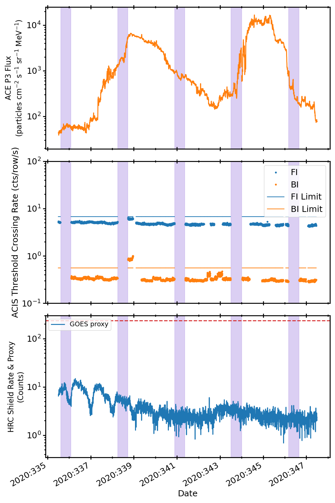
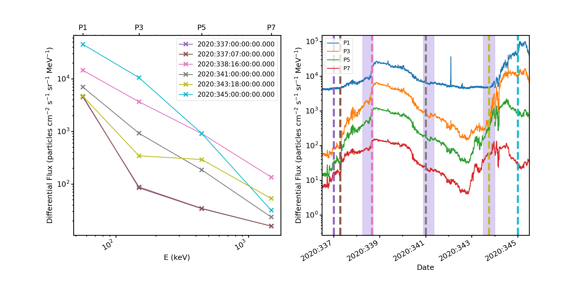
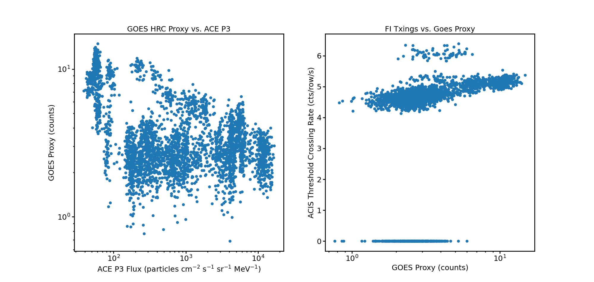
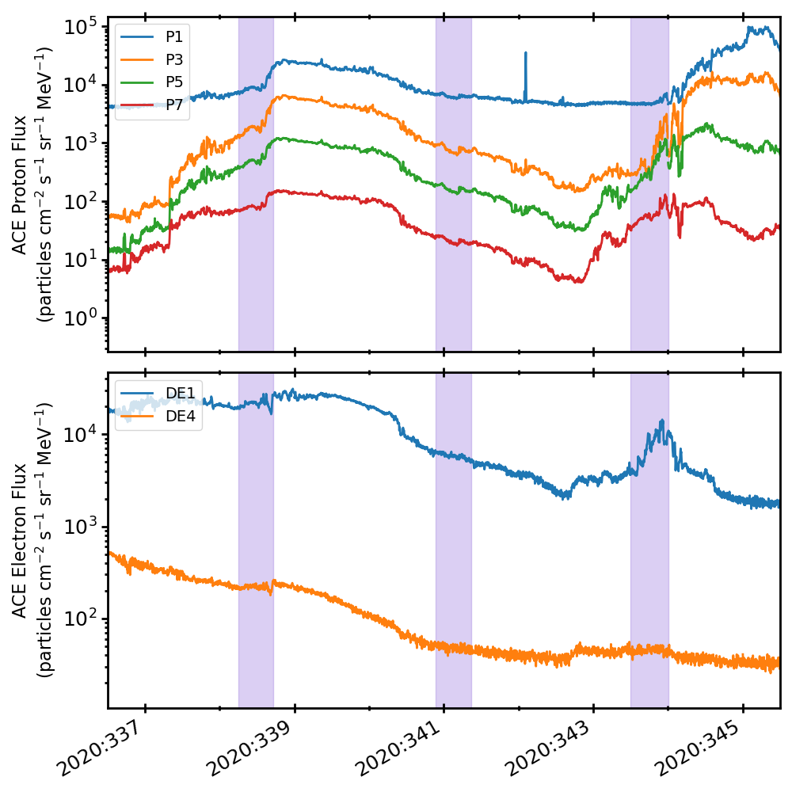

.. _2020-335:

2020:335
--------------

Basic Facts
===========

* Load on Spacecraft: NOV3020A  
* Shutdown: NO  

Plots
=====

Radiation vs. Time
++++++++++++++++++

Proton Spectra at Selected Times
++++++++++++++++++++++++++++++++

Scatter Plots
+++++++++++++

ACE Plots
+++++++++

Goes Proton Plots
+++++++++++++++++

.. image:: goes_r_vs_time.png

