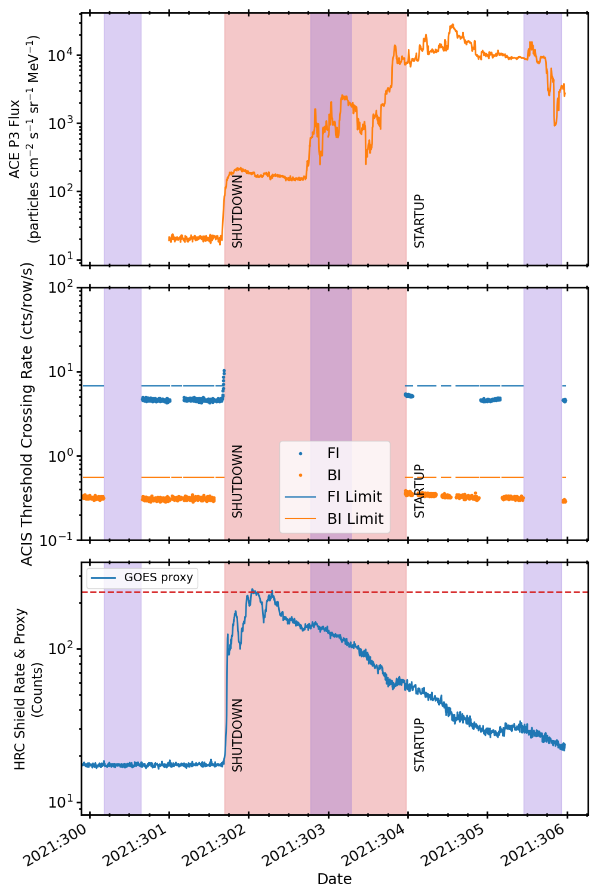

.. _2021-301:

2021:301
--------------

Basic Facts
===========

* Load on Spacecraft: OCT2521B  
* Shutdown: YES  
* Shutdown Trigger: ACIS TXings  
* Shutdown Time: 2021:301:16:35:00.000  
* Startup Time: 2021:303:23:30:00.000  

Plots
=====

Radiation vs. Time
++++++++++++++++++

Proton Spectra at Selected Times
++++++++++++++++++++++++++++++++

.. image:: proton_spectra.png

Scatter Plots
+++++++++++++

Proton & Electron Plots
+++++++++++++++++++++++

