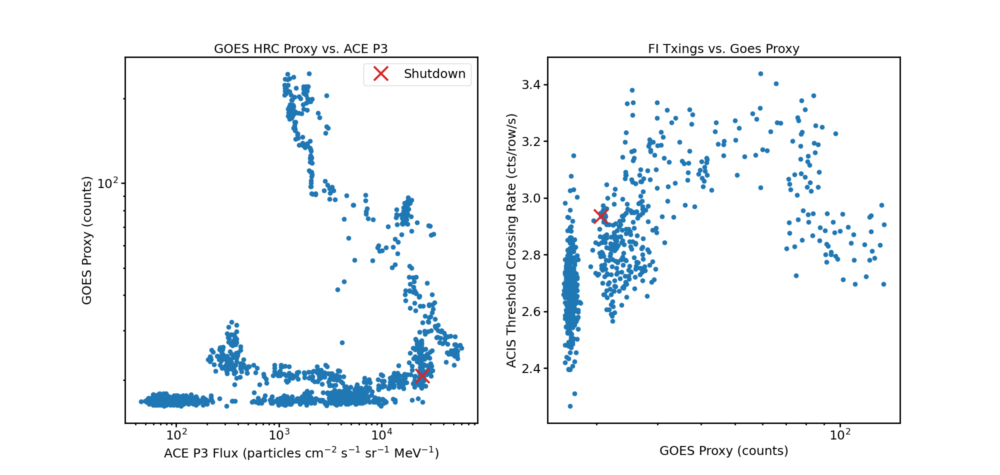
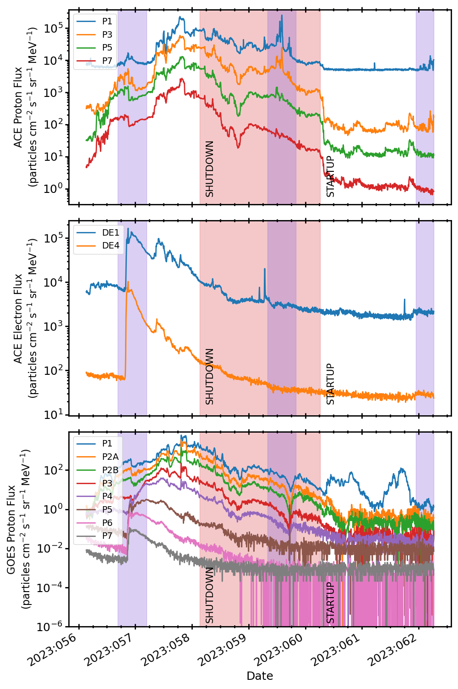

.. _2023-058:

2023:058
--------------

Basic Facts
===========

* Load on Spacecraft: FEB2423A  
* Shutdown: YES  
* Shutdown Trigger: Manual  
* Shutdown Time: 2023:058:03:14:49.000  
* Startup Time: 2023:060:06:29:02.000  

Plots
=====

Radiation vs. Time
++++++++++++++++++

Proton Spectra at Selected Times
++++++++++++++++++++++++++++++++

.. image:: proton_spectra.png

Scatter Plots
+++++++++++++

Proton & Electron Plots
+++++++++++++++++++++++

