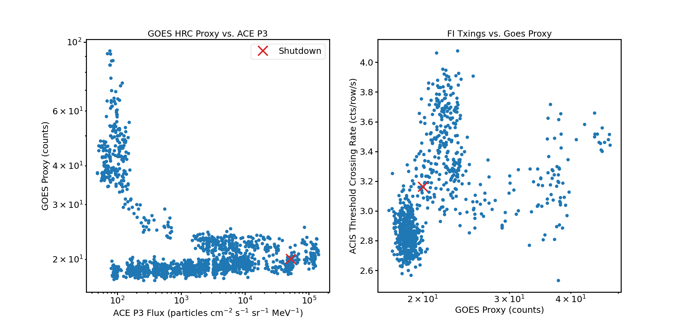
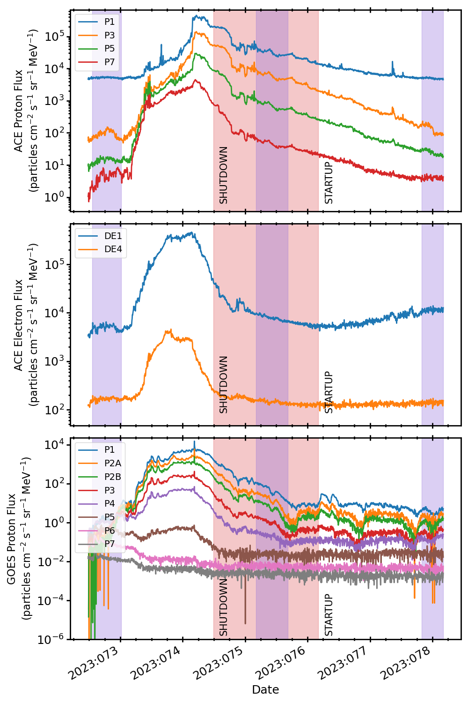

.. _2023-074:

2023:074
--------------

Basic Facts
===========

* Load on Spacecraft: MAR1323A  
* Shutdown: YES  
* Shutdown Trigger: Manual  
* Shutdown Time: 2023:074:11:37:45.000  
* Startup Time: 2023:076:04:13:58.000  

Plots
=====

Radiation vs. Time
++++++++++++++++++

Proton Spectra at Selected Times
++++++++++++++++++++++++++++++++

.. image:: proton_spectra.png

Scatter Plots
+++++++++++++

Proton & Electron Plots
+++++++++++++++++++++++

