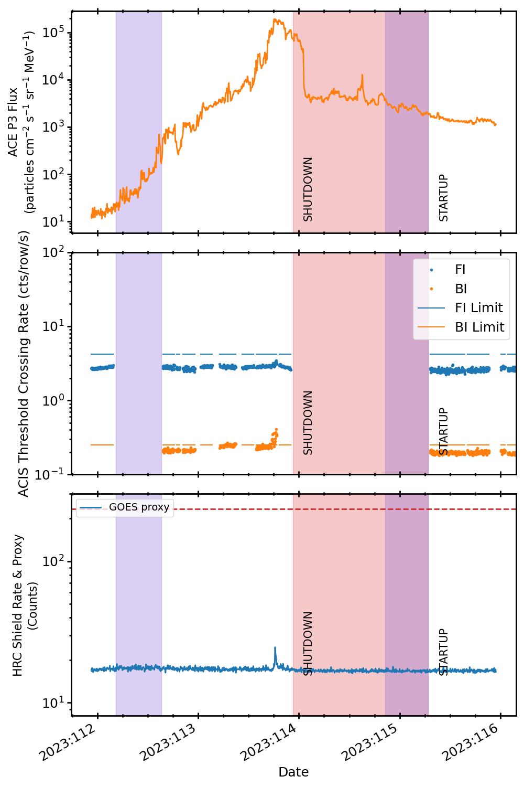

.. _2023-113:

2023:113
--------------

Basic Facts
===========

* Load on Spacecraft: APR2423B  
* Shutdown: YES  
* Shutdown Trigger: Manual  
* Shutdown Time: 2023:113:22:34:00.000  
* Startup Time: 2023:115:06:54:12.657  

Plots
=====

Radiation vs. Time
++++++++++++++++++

Proton Spectral Index
+++++++++++++++++++++

Scatter Plots
+++++++++++++

Proton & Electron Plots
+++++++++++++++++++++++

